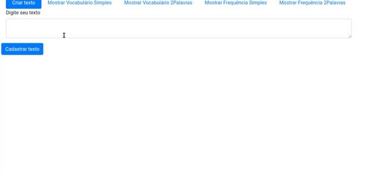
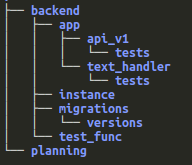
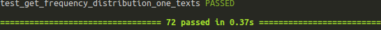
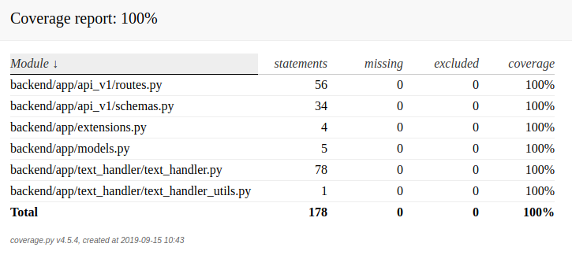
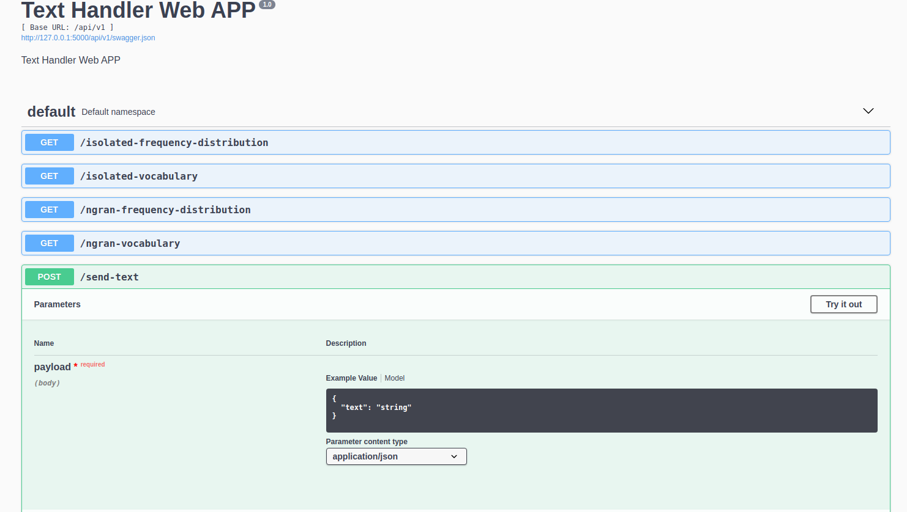

# Text Handler Web APP

Esse APP tem o objetivo de receber textos e analisá-los para encontrar a frequência de cada palavra. Pra isso o projeto foi feito em duas frentes, sendo elas uma classe e o REST.

A classe manipula os textos e retorna a resposta. Essa classe virou a app/api_v1/text_handler/text_handler.py::TextHandler e pode ser utilizada em várias API's.

O aplicativo API Rest foi criado utilizando o framework Flask.



## Estrutura
A estrutura do projeto é ilustrado na imagem a seguir.



## Instação

O projeto precisa que o pipenv e docker estejam instalados.

### Instalando as bibliotecas python requeridas para o projeto

Caminhe até a pasta backend
```bash
cd backend/
```

Digite o comando a seguir:

```bash
pipenv install
```

### Postgres

O projeto utiliza o banco de dados postgres. Para padronizar o projeto, a ferramenta *docker* foi utilizada para instalar o banco.

Caminhe até a pasta backend
```bash
cd backend/
```

Digite o comando a seguir:

```bash
docker-compose up
```


## Projeto

O projeto foi escrito na linguaguem python 3.7. Durante o desenvolvimento foi utilizado a técnica de *test driven development (tdd)*.

### TextHandler (backend/app/text_handler/text_handler.py)

O *TextHandler* é uma classe que recebe como paramêtro uma lista de string, que representa o textos, e processa a lista através de um dos 4 métodos.

Para realizar o processamento do texto, a biblioteca *nltk* foi utilizada.

#### Métodos e suas funções:

1. sw_vocabulary

Cria uma lista de palavras únicas presentes nos textos, seguindo algumas condições como a não presença de stop-words, palavras que começam com número e todas devem ser minúsculas.

2. sw_frequency_distribution

Com a lista de palavras criadas no sw_vocabulary, esse método checa a frequência que cada palavra na lista aparece em cada texto

3. ng_vocabulary

Cria uma lista de lista de palavras seguidas presentes nos textos, seguindo algumas condições como a não presença de stop-words, palavras que começam com número e todas devem ser minúsculas.

4. ng_frequency_distribution

Com a lista de palavras criadas no ng_vocabulary, esse método checa a frequência que cada palavra na lista aparece em cada texto


### REST API

O projeto para a *Rest API* foi feito utilizando *Flask Framework* e Flask-RESTPlus extensão como base do projeto e utilizado as bibliotecas: Marshmallow para realizar a deserialização e serialização dos dados trafegados; Flask-Migrate para realizar o versionamento do banco de dados; e a Flask-SQLAlchemy para controlar os acessos ao banco de dados.

Algumas permissão foram seguidas no desenvolvimento:

1. Todo dado que entra ou sai do sistema deve passar por um schema criado pela biblioteca Marshmallow.
2. Toda entrar ou saída do sistema deverá ser feito em json.

### Testes

O projeto conta com cerca de 80 testes que foram criados durante o desenvolvimento.



Utilizando a biblioteca coverage conseguimos mensurar que os testes passaram pelo menos uma vez por cada linha.




#### Como executar os teste
Para executar os teste digite o comando a baixo:

```bash
pytest
```

### Documentação API
A documentação da API está no endpoint /api/v1.




## Licença
[MIT](https://choosealicense.com/licenses/mit/)

